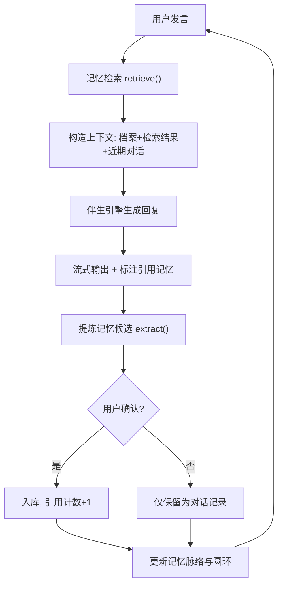

# Archer 写作伴生 Demo — 产品需求文档（PRD）v2

> TRAE AI 创造力大赛 · 学习工作赛道 · 初赛 Demo
> 形态：单个自洽 HTML 文件（zip 打包上传，双击即可体验，零后端依赖）
> v2 核心转变：从「工具页」改为「对话式伴生体」，记忆在每轮对话中被检索、注入、引用、生长

## 1. 产品概述

Archer 写作伴生 Demo 是终端版 Archer 在「学习工作」场景下的可体验切片。它是一个**对话式写作伴生体**——不是填表单的工具，而是一个会主动回唤你的记忆、在对话中引用它想起的东西、并持续提炼新记忆的伙伴。

- **要解决的问题**：现有 AI 每次对话都像重新认识你；写作时反复解释背景；记忆沉下去调不出来；工具化的 AI 只给结果不「在场」。
- **目标用户**：长期写作者、知识管理用户、用写作和复盘重建生活系统的人。
- **价值**：让评委在对话中**看见记忆被调用**——Archer 回复时会标注「我想起了…」，关掉重开它主动回唤，越聊它越懂你。这是模板填空器给不了的灵性。

> 定位：纯前端模拟，不接 LLM。伴生引擎用检索+模板模拟真实 Archer 的记忆检索与 Context 注入。真正的 Archer 具备完整灵魂系统与 18 技能。

## 2. 核心功能

### 2.1 用户角色

单一角色：创作者（体验者/评委）。无注册登录，localStorage 持久化。

### 2.2 功能模块

1. **开场回唤（Recall）**：进入即对话。有档案时 Archer 主动开口，引用 2–3 条相关记忆（「上次你说在写…」「你偏好…语气，我记着」），证明记忆跨会话仍在。无档案时引导建档。
2. **对话场（Dialogue）**：核心交互。用户发消息 → Archer 检索相关记忆 → 注入上下文 → 流式回复 → 回复中标注引用了哪些记忆 → 从对话中提炼新记忆候选。
3. **记忆脉络（Memory Thread）**：侧栏可视化。展示记忆如何被检索、被引用、被新增——记忆不是静态列表，而是「活的脉络」。
4. **记忆生长（Growth）**：每条记忆有「被引用次数」「最近调用时间」。越用越活，不用则淡——模拟真实 Archer 的 importance decay。

### 2.3 页面详情

| 视图 | 模块 | 功能描述 |
|---|---|---|
| 开场 | 回唤气泡 | Archer 主动发消息，引用历史记忆，带「记忆回唤」标签 |
| 对话场 | 消息流 | 用户/Archer 气泡交替，Archer 回复带流式打字效果 |
| 对话场 | 记忆引用 | Archer 回复上方/内嵌「💡 我想起了」卡片，列出本轮调用的记忆 |
| 对话场 | 记忆候选 | 对话后 Archer 提炼「这句话值得记住吗？」候选，用户确认 |
| 对话场 | 输入区 | 多行输入，支持快捷指令（/memory /review /new） |
| 记忆脉络 | 侧栏 | 记忆列表，按「最近引用」排序，显示引用次数与活跃度 |
| 记忆脉络 | 记忆之环 | 圆环可视化，五色段按类型，段亮度=该类记忆活跃度 |

## 3. 核心流程

**对话循环**：用户发言 → `retrieve(query, topK=3)` 检索相关记忆 → 构造上下文（档案+检索结果+近期对话） → 生成回复（模板+引用标注） → 流式输出 → `extract()` 提炼记忆候选 → 用户确认 → 入库 → 更新记忆引用计数。

**跨会话**：新会话 → Archer 主动开口 → `recall(profile, lastTopics, topK=3)` → 引用 2–3 条记忆 → 用户感受到「它记得」。

## 4. 用户界面设计

### 4.1 设计风格

科技人文 + 灵性，区别于普通 AI 聊天框：

- **主色**：深色场域 `#0e1116`（夜空感）+ Archer 五色光谱作星光强调；浅色模式暖白 `#f7f3ec`。
- **字体**：标题/点睛用 **马善政体** 手写字（人文）；正文衬线 Noto Serif SC；代码/记忆ID用等宽（科技）。
- **记忆引用卡**：半透明玻璃拟态，青蓝渐变边框，带「💡 我想起了」标签——让记忆调用可见。
- **流式回复**：打字机效果，光标闪烁，回复逐字浮现——在场感。
- **记忆脉络**：侧栏记忆条目带「活跃度」光点（引用越多越亮），圆环段亮度随活跃度变化。
- **去玄学**：不出现「灵魂/SOUL」，用「记忆/在场/伴生/回唤」。

### 4.2 关键交互细节

- Archer 回复时，引用的记忆以小卡片形式**内嵌在回复上方**，可点击查看详情
- 记忆候选以**轻量气泡**出现在对话末尾，✓ 记住 / ✕ 忽略
- 新会话时，开场回唤气泡带**脉冲光效**，强调「它主动想起你」
- 记忆之环的色段**亮度随引用次数变化**，不用则渐暗（decay 可视化）

### 4.3 响应式

桌面优先（侧栏+对话场），移动端侧栏抽屉化，对话场全屏。

## 5. 与真实 Archer 的映射

| Demo | 真实 Archer |
|---|---|
| localStorage 记忆层 | SQLite 10 表 + sqlite-vec 向量检索 |
| TF-IDF 检索模拟 | 混合检索（向量优先+FTS5） |
| 模板+引用生成 | LLM + 8 层 Context 注入 |
| 提炼候选→确认 | `_bg_extract()` → pending_memories → accept |
| 引用计数/decay | `importance` + `last_used_at` + `run_importance_decay()` |
| 开场回唤 | `classify_query_intent` + MEMORY.md 注入 |
