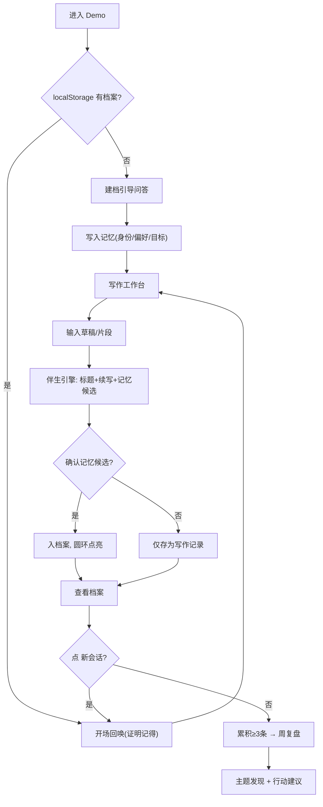

# Archer 写作伴生 Demo — 产品需求文档（PRD）

> TRAE AI 创造力大赛 · 学习工作赛道 · 初赛 Demo
> 形态：单个自洽 HTML 文件（zip 打包上传，双击即可体验，零后端依赖）

## 1. 产品概述

Archer 写作伴生 Demo 是终端版 Archer（长期记忆 + 灵魂人格 AI 智能体）在「学习工作」场景下的一个可体验切片。它把 Archer 最核心的能力——**长期记忆**与**写作伴生**——浓缩成一个浏览器里能跑、能记住你、越用越懂你的写作伙伴。

- **要解决的问题**：每次打开 AI 都像重新认识你；写作时反复解释背景、风格、选题方向；有价值的记录沉下去就调不出来。
- **目标用户**：长期写作者、公众号/小红书/B 站创作者、知识管理用户、Obsidian/Flomo 用户、用写作和复盘重建生活系统的人。
- **价值**：让评委在 3 分钟内「看见记忆在累积」——关掉重开它还记得你，基于记忆帮你起标题、续写、做周复盘。这是普通一次性聊天机器人给不了的连续性。

> 定位说明：本 Demo 是 Archer 能力的展示切片，真正的 Archer 是运行在终端、具备完整灵魂系统与 18 个技能的智能体，能力更强。Demo 用纯前端模拟其「记忆 + 写作伴生」体验，不接入真实 LLM（无需 API Key，评委双击即用）。

## 2. 核心功能

### 2.1 用户角色

单一角色：**创作者（体验者/评委）**。无注册，无登录，首次进入引导建档，数据存浏览器 localStorage。

### 2.2 功能模块（单页多视图）

1. **开场视图（Hero）**：Archer 圆环 + 手写字标题，一句话点题「会记住你的写作伙伴」，进入建档或直接体验。
2. **写作工作台（Workspace）**：核心交互区。输入草稿/片段 → Archer 给出标题建议、续写片段、并提炼记忆候选。
3. **写作档案（Profile/Memory）**：展示 Archer 记住了什么——按类型分组的记忆卡片（身份/偏好/目标/选题/洞察）。
4. **周复盘（Review）**：从累积的写作记录里归纳反复出现的主题，给出一句话行动建议。

### 2.3 页面详情

| 视图 | 模块 | 功能描述 |
|---|---|---|
| 开场 | 圆环视觉 | 五色光谱圆环 + 有机形变动效，手写字主标题 |
| 开场 | 进入引导 | 首次：建档；已有档案：直接回唤进入工作台 |
| 建档 | 引导问答 | 3–4 个问题：称呼、写作领域、风格偏好、当前目标 → 写入记忆 |
| 工作台 | 草稿输入 | 多行文本输入，支持「生成标题 / 续写 / 存为记录」 |
| 工作台 | 伴生建议 | 基于档案生成 2–3 个标题 + 1 段续写（风格匹配） |
| 工作台 | 记忆候选 | 从输入中提炼关键词 → 待确认 → 确认后入档案 |
| 档案 | 记忆列表 | 按类型分组展示，可删除/归档，显示来源与时间 |
| 档案 | 记忆之环 | 圆环可视化：记忆越多，环越「饱满」（颜色段点亮） |
| 周复盘 | 主题发现 | 统计高频词/重复主题，生成 3 条主题 + 行动建议 |
| 全局 | 新会话按钮 | 模拟关闭重开：清空当前对话视图，保留 localStorage，开场回唤证明记忆仍在 |

## 3. 核心流程

**首次体验流程**：进入 → 建档问答 → 记忆写入档案 → 进入工作台 → 写一段 → Archer 给标题/续写/记忆候选 → 确认记忆 → 查看档案（环点亮）→ 点「新会话」→ 开场回唤「又见面了，[称呼]，上次你在写 [选题]…」→ 证明跨会话记忆。

**周复盘流程**：累积 ≥3 条写作记录 → 进入周复盘 → 引擎统计高频主题 → 生成主题卡片 + 行动建议。

## 4. 用户界面设计

### 4.1 设计风格

延续 Archer 既有视觉资产（报名帖品牌连续性），但从「灵魂/玄学」转向「写作/在场」：

- **主色**：暖白底 `#f7f3ec` + Archer 五色光谱圆环（青/蓝/琥珀/橙/红）作强调；墨色文字 `#2a2a26`。
- **辅助色**：墨绿 `#3d5240`（沉稳）、淡金 `#bfa06a`（温暖）。
- **字体**：标题/点睛用 **马善政体（Ma Shan Zheng）** 手写字——天然契合「写作」主题；正文用 Charter/Georgia 衬线 + PingFang SC，营造书写质感。**禁用** Inter/Roboto/Arial 等通用无衬线。
- **按钮**：圆角胶囊，主操作用橙→红渐变，次操作描边。
- **布局**：单栏为主，工作台左右分栏（输入区 + 伴生建议区），档案用卡片网格。
- **动效**：圆环有机形变呼吸、记忆卡片浮入、记忆入库时圆环对应色段点亮（高光时刻）。
- **去玄学化**：全文不出现「灵魂/SOUL/伴生体」等词，改用「记忆/写作伙伴/档案/在场」。

### 4.2 页面设计概览

| 视图 | 模块 | UI 元素 |
|---|---|---|
| 开场 | Hero | 暖白底、五色圆环居中形变、手写字主标题、橙红渐变 CTA |
| 工作台 | 输入区 | 衬线文本框、底部操作栏（生成标题/续写/存记录） |
| 工作台 | 建议区 | 浮入卡片、青蓝渐变左边框、手写字小标题 |
| 档案 | 记忆之环 | 圆环 + 各色段按记忆类型点亮，下方分组卡片 |
| 周复盘 | 主题卡 | 墨绿底卡片、高频词标签、行动建议引述样式 |

### 4.3 响应式

桌面优先（评委多在桌面体验），移动端自适应：工作台分栏在 ≤820px 改为上下堆叠，导航折叠。触控按钮 ≥44px。

### 4.4 3D 场景

不适用（纯 2D + CSS 动效）。

## 5. 与真实 Archer 的关系

- Demo 演示的是 Archer「长期记忆 + 写作伴生」这条线的能力体验。
- 真实 Archer（终端版）具备完整灵魂系统（COVENANT/PRESENCE/SOUL 三层）、18 个技能、向量检索、自我批评等，能力远超 Demo。
- Demo 的「伴生引擎」是真实 Archer 记忆提炼 + 检索逻辑的简化模拟，用于让评委无门槛体验概念。
