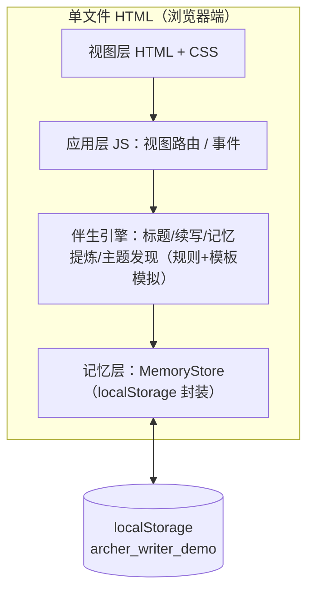
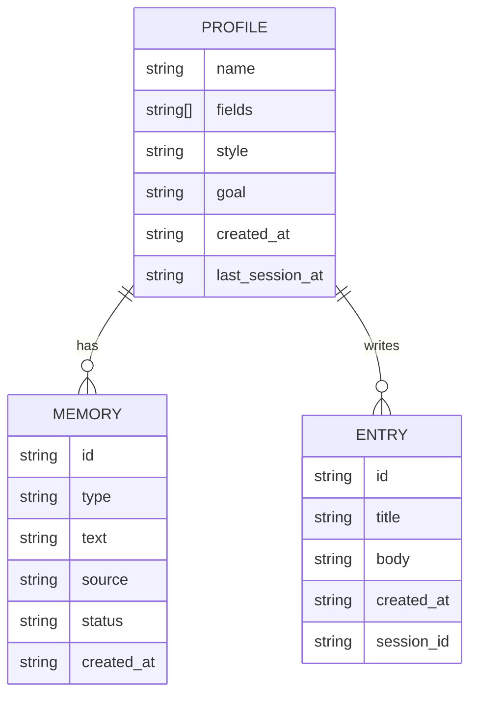

# Archer 写作伴生 Demo — 技术架构文档

> 单文件自洽 HTML · 零后端 · localStorage 持久化 · TRAE AI 创造力大赛初赛

## 1. 架构设计



**关键决策**：不使用 React/Vite/任何构建工具或后端。原因——大赛要求「HTML 格式文件 zip 打包上传，评委双击体验」，Vite 构建产物是多文件且 ES Module 需 HTTP 服务器才能跑，无法双击直接运行。单文件 HTML 是唯一同时满足「自洽 + 零依赖 + 双击可跑」的形态。

## 2. 技术说明

- **前端**：原生 HTML + CSS + 原生 JS（ES2017，无框架，无构建）。
- **字体**：Google Fonts CDN 引入 `Ma Shan Zheng`（手写）+ `Noto Serif SC`（衬线正文）。CDN 不可用时降级到本地 serif 回退。
- **图标**：内联 SVG（不依赖图标库）。
- **持久化**：`localStorage` 键 `archer_writer_demo`，存一个 JSON 对象。
- **后端 / 数据库 / 外部服务**：无。伴生引擎为纯前端规则+模板模拟，不调用任何 LLM API（避免泄露 Key、避免评委无 Key 不可用）。
- **初始化工具**：无（手写单文件）。

## 3. 视图（路由）定义

单页内 JS 视图切换（`data-view` 属性），非 URL 路由（双击打开无 server，hash 路由即可）。

| 视图 ID | 用途 |
|---|---|
| `#hero` | 开场：圆环 + 手写字 + 进入引导 |
| `#onboard` | 建档问答（首次） |
| `#workspace` | 写作工作台：输入 + 伴生建议 + 记忆候选 |
| `#profile` | 写作档案：记忆之环 + 分组记忆卡片 |
| `#review` | 周复盘：主题发现 + 行动建议 |

## 4. API 定义

无后端 API。伴生引擎为本地函数模块：

- `generateTitles(draft, profile)` → `string[]`（2–3 个标题）
- `generateContinuation(draft, profile)` → `string`（续写片段，匹配风格）
- `extractMemoryCandidates(draft)` → `{text, type, source}[]`（记忆候选）
- `discoverThemes(entries)` → `{name, count, evidence[], suggestion}[]`（主题）
- `recallOnOpen(profile, lastEntry)` → `string`（开场回唤语）

## 5. 数据模型

### 5.1 数据模型定义



### 5.2 数据定义（localStorage schema）

```json
{
  "profile": {
    "name": "枫弋",
    "fields": ["个人成长", "AI 工具"],
    "style": "warm",
    "goal": "每周写一篇深度长文",
    "created_at": "2026-06-24T10:00:00Z",
    "last_session_at": "2026-06-24T10:00:00Z"
  },
  "memories": [
    { "id": "m1", "type": "identity", "text": "称呼：枫弋", "source": "建档", "status": "active", "created_at": "..." },
    { "id": "m2", "type": "preference", "text": "偏好温暖克制的语气", "source": "建档", "status": "active", "created_at": "..." },
    { "id": "m3", "type": "topic", "text": "在写：长期记忆与写作伴生", "source": "工作台", "status": "active", "created_at": "..." }
  ],
  "entries": [
    { "id": "e1", "title": "...", "body": "...", "session_id": "20260624-100000-abc", "created_at": "..." }
  ],
  "session": { "id": "20260624-100000-abc", "opened_at": "..." }
}
```

记忆类型（对齐真实 Archer）：`identity`（身份）/ `preference`（偏好）/ `goal`（目标）/ `topic`（选题）/ `insight`（洞察）。圆环五色段对应这五类，记忆入库时点亮对应色段。

## 6. 与真实 Archer 的映射

| Demo 模拟 | 真实 Archer 实现 |
|---|---|
| localStorage 记忆层 | SQLite 10 表 + 向量检索（sqlite-vec） |
| 伴生引擎规则模板 | LLM function calling + 8 层 Context 注入 |
| 记忆候选→确认 | `_bg_extract()` 后台提炼 → pending_memories → accept |
| 主题发现统计 | `memory/patterns.py` 跨会话主题检测（三重门控） |
| 开场回唤 | `classify_query_intent` + MEMORY.md 注入 |

Demo 是真实 Archer 概念的可体验投影，非功能等价物。
