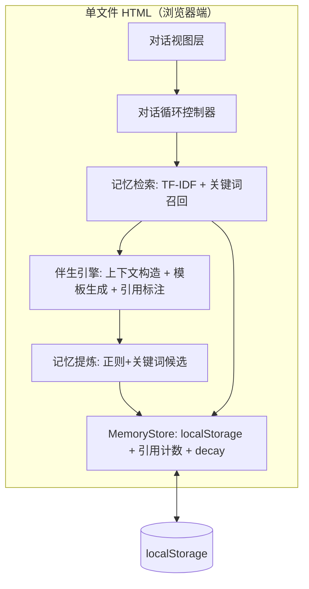

# Archer 写作伴生 Demo — 技术架构文档 v2

> 单文件自洽 HTML · 零后端 · localStorage · 对话式伴生体

## 1. 架构设计



## 2. 技术说明

- 原生 HTML + CSS + JS（ES2017，无框架无构建）
- 字体：Google Fonts（马善政体 + Noto Serif SC + JetBrains Mono）
- 持久化：localStorage 键 `archer_writer_v2`
- 无后端、无 LLM API

## 3. 视图

| 视图 | 用途 |
|---|---|
| `#stage` | 对话场（主视图）：消息流 + 输入区 |
| `#onboard` | 建档（首次） |
| 侧栏 `#thread` | 记忆脉络：列表 + 圆环 |

## 4. 记忆检索机制（核心）

### 4.1 TF-IDF 检索（模拟向量检索）

```js
retrieve(query, topK=3) {
  // 1. 分词（中文 2-3 gram + 词典分词）
  // 2. 计算每条记忆与 query 的 TF-IDF 相似度
  // 3. 叠加关键词命中加分
  // 4. 叠加 recency 加分（最近引用的略微提权）
  // 5. 返回 topK，附带相似度分数
}
```

### 4.2 上下文注入

```js
buildContext(query, profile, retrieved, recentTurns) {
  // = 真实 Archer 的 8 层 Context 简化版
  // Layer 1: 档案摘要（身份/偏好/目标）
  // Layer 2: 检索到的记忆（标注来源）
  // Layer 3: 近 3 轮对话
  // → 拼成 prompt 供模板引擎生成回复
}
```

### 4.3 引用标注

回复生成时，记录「本轮调用了哪些记忆」，以卡片形式展示在回复上方。让记忆调用**可见、可追溯**。

## 5. 数据模型

```json
{
  "profile": { "name", "fields", "style", "goal", "created_at", "last_session_at" },
  "memories": [
    { "id", "type", "text", "source", "status", "created_at",
      "ref_count": 0,          // 被引用次数
      "last_used_at": null     // 最近调用时间（decay 基准）
    }
  ],
  "entries": [ { "id", "role", "content", "refs": [], "session_id", "created_at" } ],
  "session": { "id", "opened_at" }
}
```

记忆类型：`identity` / `preference` / `goal` / `topic` / `insight`。
decay：`ref_count` 越高越活跃，圆环段越亮；长期不引用则渐暗（视觉模拟 `run_importance_decay`）。

## 6. 伴生引擎回复生成

不接 LLM，用**上下文感知的模板系统**：

```js
generateReply(query, context) {
  // 1. 意图分类：chat / writing / reflection / decision
  // 2. 按意图选回复策略
  //    - writing: 基于检索到的选题记忆给标题/角度建议
  //    - reflection: 基于历史洞察追问
  //    - decision: 引用偏好记忆给倾向性建议
  //    - chat: 基于档案的个性化回应
  // 3. 回复中自然嵌入引用（「你之前说过…」「按你偏好的…语气」）
  // 4. 返回 { text, refs: [memoryIds] }
}
```

虽是模板，但**每条回复都基于检索到的真实记忆**，所以个性化且可追溯——这是区别于「随便一个 AI」的关键。
